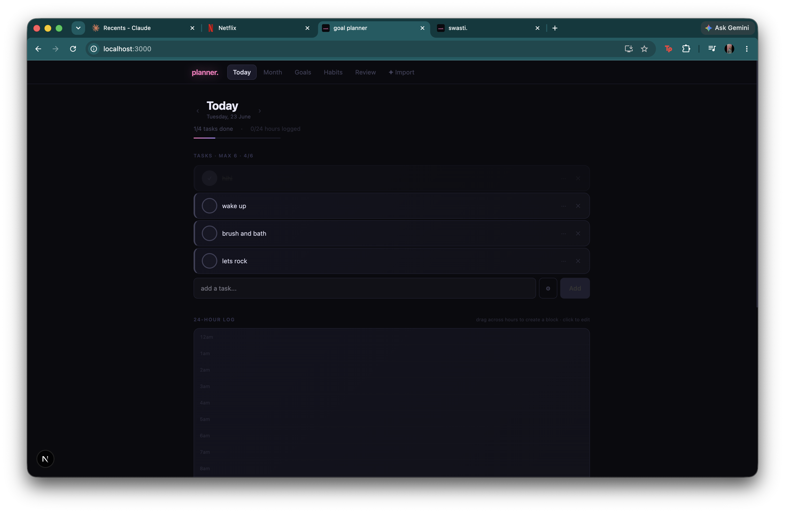
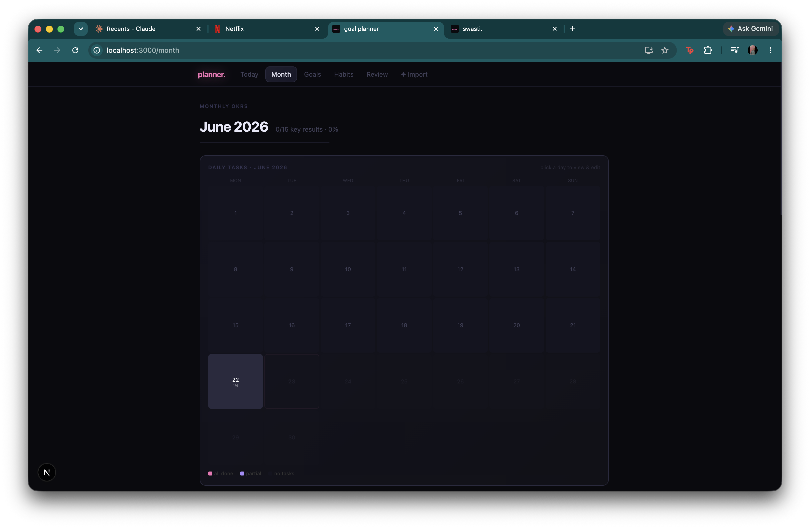
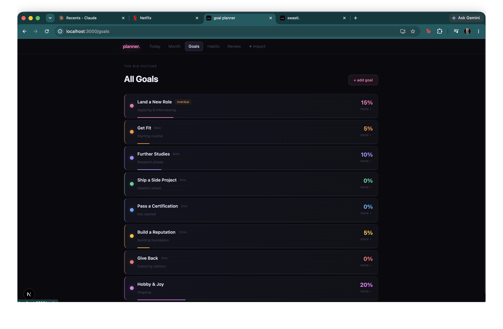
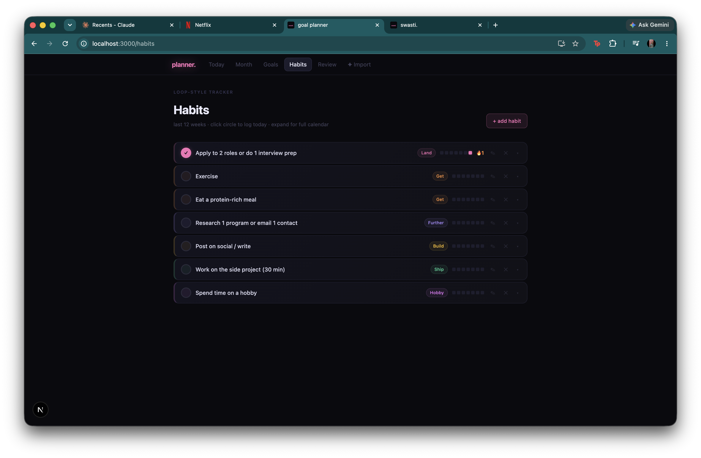
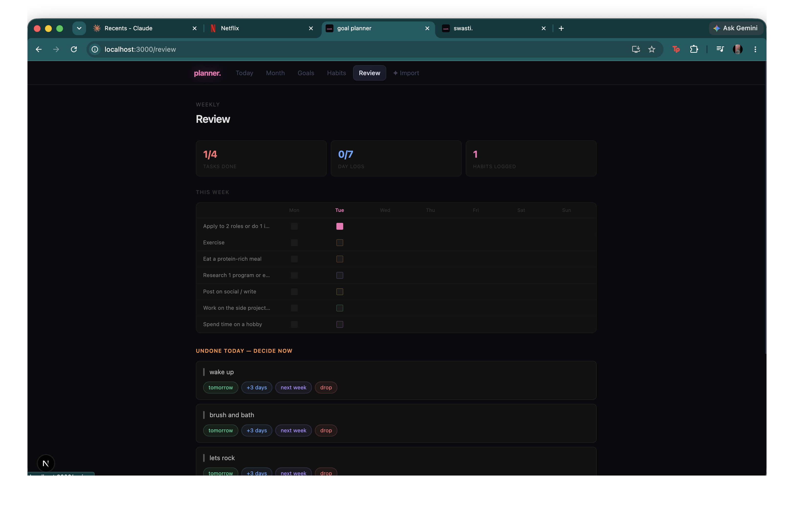
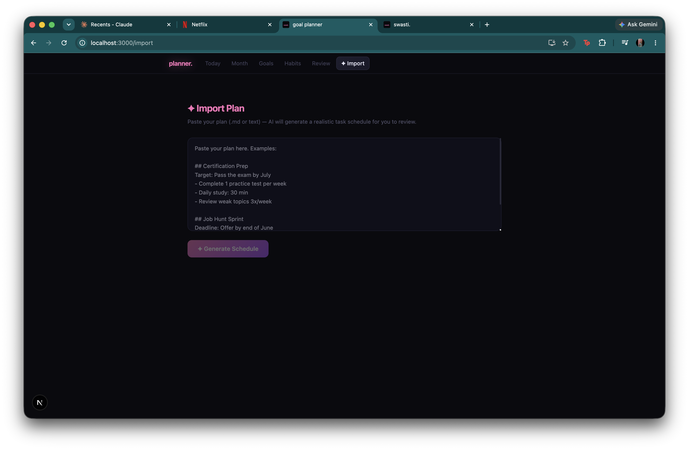

# Goal Planner

A dark-mode, single-user personal goal planner built with **Next.js 16**, **Supabase**, and the **OpenAI API**. Track daily tasks, habits, monthly OKRs, weekly reviews, and chat with a brutally-honest AI coach that knows your goals.

> This is the generic/public version. The seed data, AI-coach prompt, and branding are all placeholders — customise them to make it yours.

## Screenshots

| Today | Month |
|---|---|
|  |  |

| Goals | Habits |
|---|---|
|  |  |

| Review | Import |
|---|---|
|  |  |

## Features

- **Today** — daily task list + hour-by-hour time log, with auto-generated recurring tasks
- **Month** — calendar heat-grid + per-goal OKR / milestone tracker
- **Goals** — goal cards with progress, inline phase editing, add new goals
- **Habits** — weekly grid tracker with streak counts
- **Review** — weekly summary, roll-over of undone tasks, AI chat seeded with your week's data
- **Import** — paste a free-text plan and have the AI turn it into a scheduled task list

## Stack

- Next.js 16 (App Router, Turbopack) + React 19
- Supabase (Postgres) for storage
- OpenAI GPT-4o for the AI coach and plan importer
- Inline-styled, dark/pink design system (no UI framework)

## Setup

1. **Install**
   ```bash
   npm install
   ```

2. **Create a Supabase project** and run the SQL files in order in the SQL editor:
   `supabase-schema.sql` → `-v2` → `-v3` → `-v4` → `-v5`.
   These create the tables and seed a set of **example** goals/habits you can replace.

3. **Configure env** — copy `.env.example` to `.env.local` and fill in your Supabase URL + anon key:
   ```
   NEXT_PUBLIC_SUPABASE_URL=...
   NEXT_PUBLIC_SUPABASE_ANON_KEY=...
   ```
   > The AI coach and plan importer are **stubbed in this demo**, so no OpenAI key is required. To use the real AI, add `OPENAI_API_KEY` and restore the OpenAI calls in `src/app/api/chat/route.ts` and `src/app/api/plan/route.ts`.

4. **Run**
   ```bash
   npm run dev
   ```
   Open [http://localhost:3000](http://localhost:3000).

## Make it yours

- Edit the AI-coach system prompt in `src/app/api/chat/route.ts`.
- Edit the scheduler prompt in `src/app/api/plan/route.ts`.
- Replace the example seed goals/habits in `supabase-schema.sql`.
- Change the brand name in `src/app/components/Nav.tsx` and `src/app/layout.tsx`.

## Notes

- Single-user app: Row Level Security uses permissive "Allow all" policies. Add auth before exposing it publicly.
- `.env.local` is gitignored — never commit your keys.
